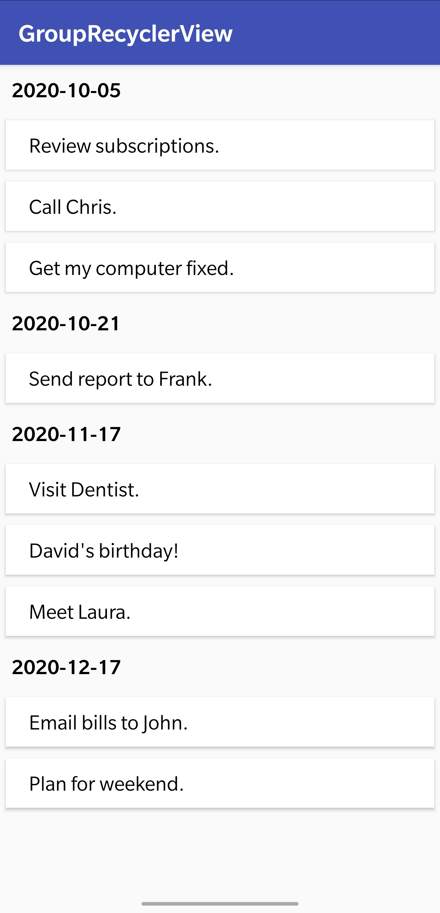

# GroupsRecyclerView
Grouping data in a RecyclerView.

The Data is grouped using TreeMap, which can also be done using HashMap.

        TreeMap<String, List<DataModel>> groupedTreeMap = new TreeMap<>();

        for (DataModel dataModel : listOfDataModel) {

            String treeMapKey = dataModel.getDate();

            if (groupedTreeMap.containsKey(treeMapKey)) {
                // when there is an existing key.
                groupedTreeMap.get(treeMapKey).add(dataModel);  
            } else {
                // when new key is to be added.
                List<DataModel> list = new ArrayList<>();
                list.add(dataModel);
                groupedTreeMap.put(treeMapKey, list);
            }
        }
        return groupedTreeMap;
        

Fetching values from TreeMap to an Arraylist.

        
        List<ListItem> groupedList = new ArrayList<>();
        for (String date : groupedHashMap.keySet()) {
            DateItem dateItem = new DateItem();
            dateItem.setDate(date);
            groupedList.add(dateItem);

            for (DataModel dataModel : groupedHashMap.get(date)) {
                TaskItem taskItem = new TaskItem();
                taskItem.setDataModel(dataModel);
                groupedList.add(taskItem);
            }
        }
        
ListItem class specifies the type of data fetched, i,e. Date or Task.
        
The tasks in the DataModel.java are grouped with respect to their dates, Hence date is the Key used in the TreeMap.

